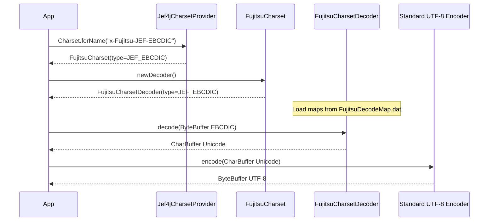
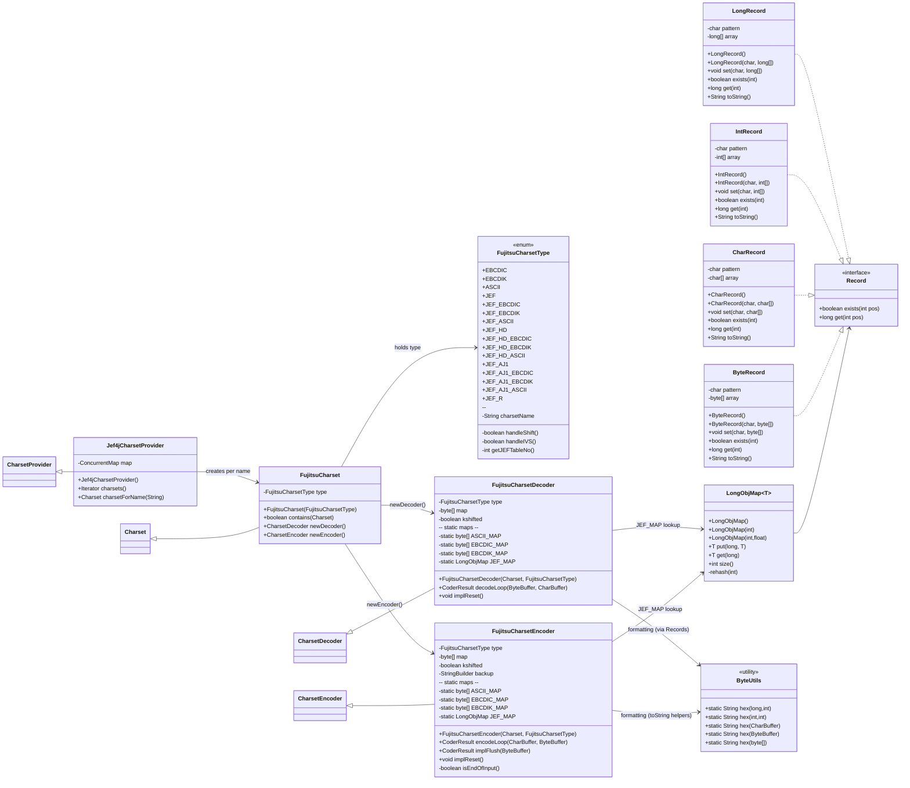
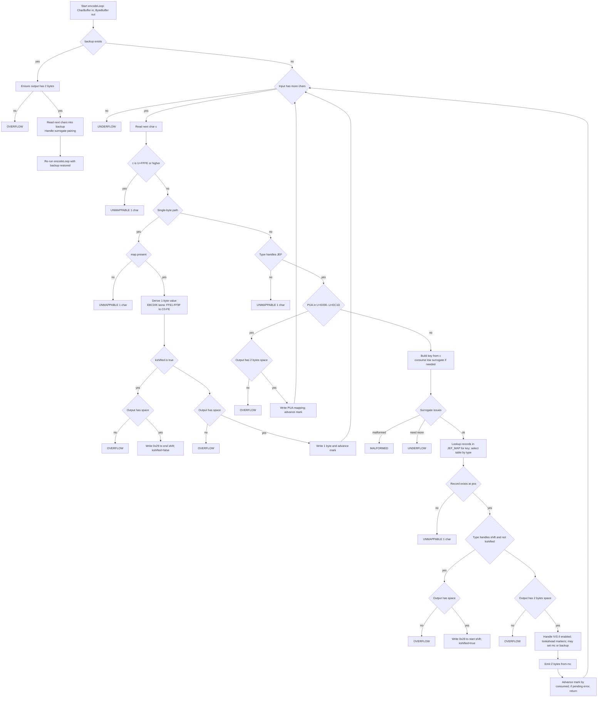
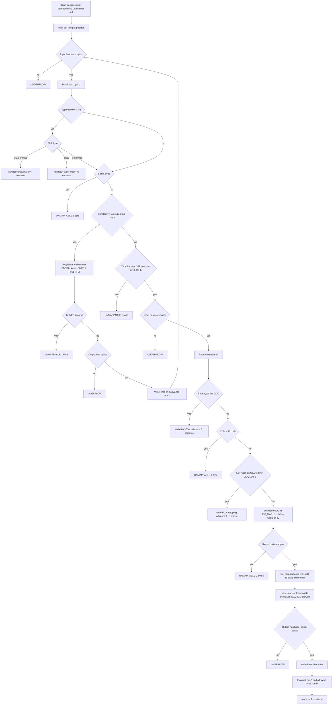
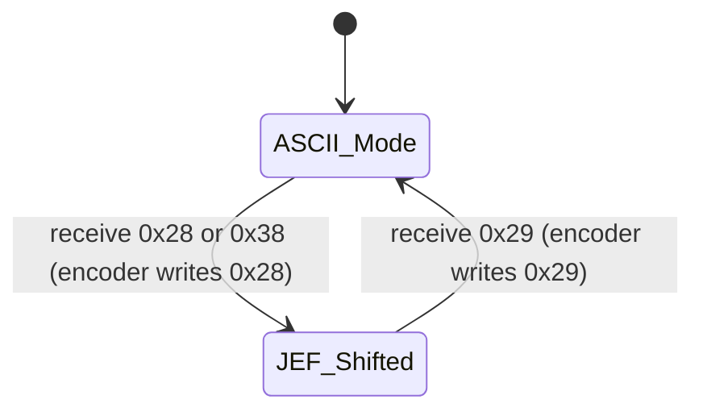
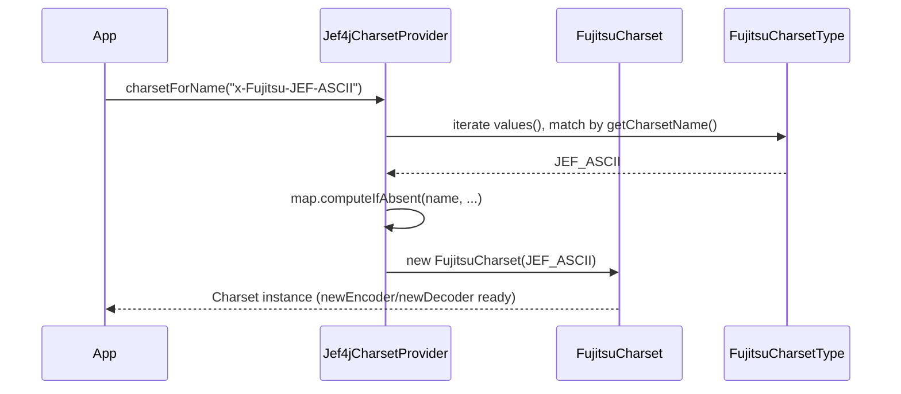

# Diagrams

## End‑to‑end flow: EBCDIC Fujitsu bytes → UTF‑8 bytes

**Components involved**

`net/arnx/jef4j/Jef4jCharsetProvider`: SPI provider that creates custom Charset instances by name.

`net/arnx/jef4j/FujitsuCharset`: A `java.nio.charset.Charset` wrapper that returns the matching encoder/decoder.

`net/arnx/jef4j/FujitsuCharsetType`: Enum defining Fujitsu flavors like EBCDIC, JEF_EBCDIC, JEF_HD_EBCDIC, etc., with flags

- `handleShift()`: toggles 0x28/0x38 shift-in and 0x29 shift-out handling.
- `handleJEF()`: toggles JEF double‑byte logic.
- `handleIVS()`: allows IVS (variation selectors) logic during encode/decode.
- `getJEFTableNo()`: selects a JEF table variant.

`net/arnx/jef4j/FujitsuCharsetDecoder`: Decodes EBCDIC/JEF bytes to Unicode chars. Loads mapping tables from `FujitsuDecodeMap.dat` and handle:
- Single-byte maps EBCDIC_MAP/EBCDIK_MAP (and ASCII variant)
- JEF double-byte mapping via JEF_MAP when `handleJEF()`
- Optional shift-in/out handling when `handleShift()`
- Optional IVS handling when `handleIVS()`

`net/arnx/jef4j/FujitsuCharsetEncoder`: The reverse direction (Unicode to Fujitsu bytes). Not used for UTF‑8 output, but helpful to understand symmetry.

Utility structures: `LongObjMap`, `Record` and its impls ( `ByteRecord`, `CharRecord`, `IntRecord`, `LongRecord`) hold compact mapping rows used by JEF lookup.

**Sequence diagram**



1. Resolve the charset:

2. Decode bytes to Unicode:

3. Encode Unicode to UTF‑8:

**Example**

```java
import java.io.*;
import java.nio.*;
import java.nio.charset.*;
import java.nio.file.*;
import java.util.*;

public class ConvertFujitsuEBCDICToUTF8 {
    public static void main(String[] args) throws Exception {
        Path inputPath = Paths.get("input.ebc");   // your EBCDIC Fujitsu file
        Path outputPath = Paths.get("output.txt"); // UTF-8 destination

        // Choose the correct Fujitsu charset name for your data:
        //   "x-Fujitsu-EBCDIC"       // single-byte EBCDIC
        //   "x-Fujitsu-JEF-EBCDIC"   // JEF double-byte with EBCDIC single-byte plane
        //   "x-Fujitsu-JEF-HanyoDenshi-EBCDIC" // with IVS/HD handling
        Charset fujitsu = Charset.forName("x-Fujitsu-JEF-EBCDIC");

        byte[] inBytes = Files.readAllBytes(inputPath);

        // Step 1: Decode Fujitsu EBCDIC/JEF -> Unicode
        CharsetDecoder decoder = fujitsu.newDecoder();
        // Optional error handling policy:
        decoder.onMalformedInput(CodingErrorAction.REPORT);
        decoder.onUnmappableCharacter(CodingErrorAction.REPORT);

        CharBuffer chars = decoder.decode(ByteBuffer.wrap(inBytes));

        // Step 2: Encode Unicode -> UTF-8
        byte[] outBytes = new String(chars.array(), 0, chars.length()).getBytes(StandardCharsets.UTF_8);
        Files.write(outputPath, outBytes);
    }
}
```

## Class relationships



## Encoding workflow (FujitsuCharsetEncoder.encodeLoop())



Key points:

- Single-byte mappings use `ASCII_MAP`, `EBCDIC_MAP`, `EBCDIK_MAP`.
- JEF double-byte mappings and IVS are resolved via `JEF_MAP`: `LongObjMap<Record[]>`.
- Shift mode uses 0x28 to enter and 0x29 to leave; `kshifted` tracks state.
- `implFlush()` ends shift (writes 0x28 if necessary) and flushes any backup.

## Decoding workflow (FujitsuCharsetDecoder.decodeLoop())



Key points:

- Single-byte decoding uses `map` when not in shift mode.
- JEF double-byte sequences decode using `JEF_MAP` and produce base character plus optional combination (IVS).
- Shift-in/out bytes handled when `type.handleShift()` is enabled.
- Private Use Area and full-width space (0x40 0x40) special cases.

## Shift state machine



## How names resolve to charsets



**Notes and guidance**
- The binary mapping tables are loaded from serialized resources: `FujitsuEncodeMap.dat` and `FujitsuDecodeMap.dat` inside `net/arnx/jef4j/` via `ObjectInputStream`. They populate `ASCII_MAP`, `EBCDIC_MAP`, `EBCDIK_MAP`, and `JEF_MAP`.

- The `Record` implementations (`ByteRecord`, `CharRecord`, `IntRecord`, `LongRecord`) provide compact storage and bit-pattern addressing; `exists(pos)` tells if an entry is present at a 4-bit bucket, and `get(pos)` returns the mapped value.

- `LongObjMap` is a specialized open-addressing hash map keyed by `long` for fast lookups of `Record[]` by masked keys.